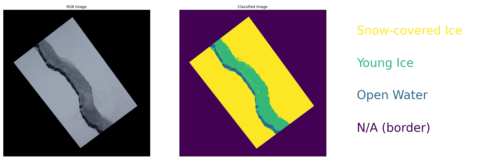
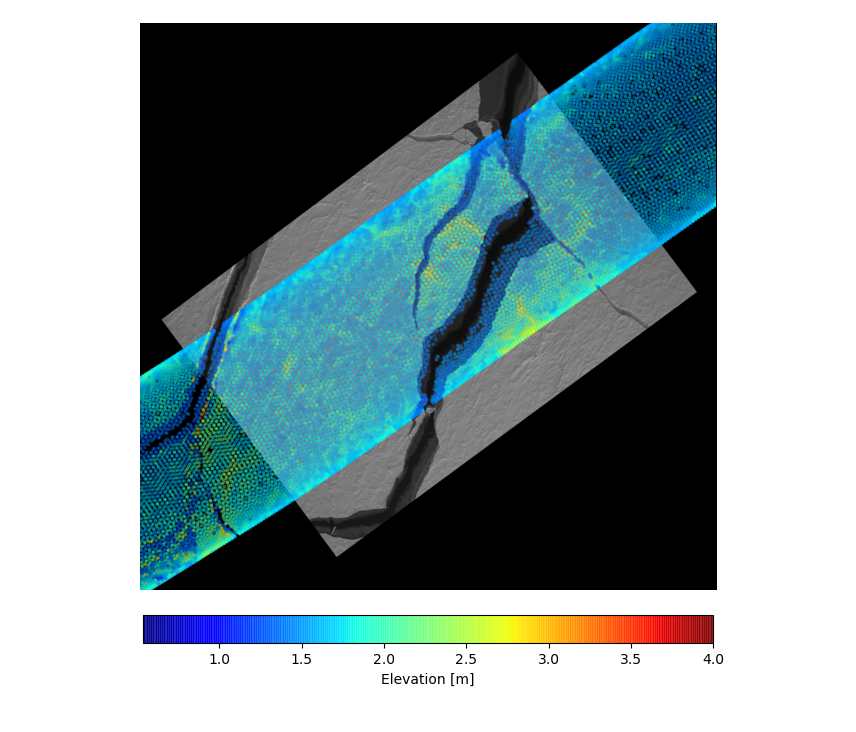

# OIBclassification
python tools to classify Operation IceBridge sea ice imagery and label ATM data for freeboard processing

## Overview
This repo contiains functions that serve 2 main purposes:
  1. Classify DMS imagery 
  2. Label ATM data 
  
Once labelled, the ATM data can be used to calculate sea ice freeboard.

For an introduction, check out the jupyter notebook file [Classify_DMS_Example](Classify_DMS_Example.ipynb)
  
### DMS Imagery Classification

These functions utilize a *simple* red-band histogram modal thresholding approach to classify the sea ice imagery into 4 distinct classes:
  0. N/A or border pixels
  1. Open water
  2. Young/gray sea ice
  3. White/snow-covered sea ice
  
An example of the output looks like this:

### ATM Labelling

These functions reproject the ATM Qfit elevation data, drape it over the classified DMS images, and label each ATM point into one of the classes listed above.  Also included are functions to plot the two datasets (to make nice pictures!)

The labelled ATM data can be used to compute a sea surface height (from lead points) and total freeboard.

